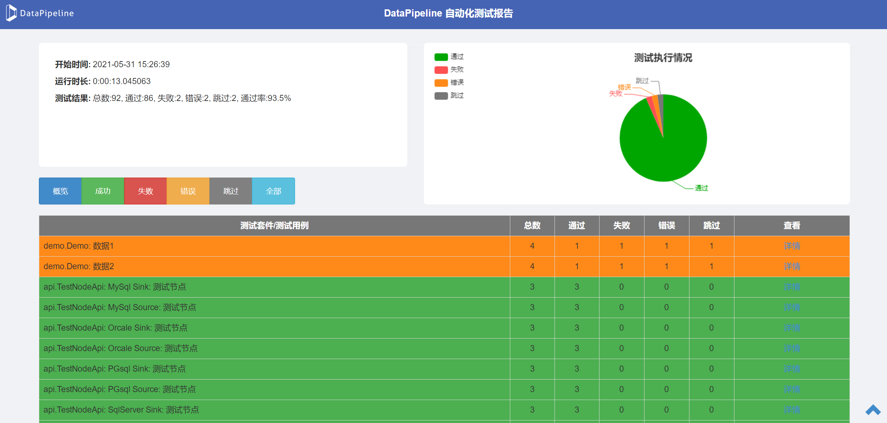

# 测试报告

测试运行结束后，框架将自动生成测试报告和所有日志文件

## 测试报告

报告结果目录结构  
> 报告根目录  
>> LATEST: 永远存储最后一次测试结果  
>> 每次运行结果: 文件夹名称为运行时刻时间戳
>>> Details: 每一个测试用例的具体测试日志文件     
>>> report.html: 结果报告静态页面  
>>> runner.log: 系统级别日志  

## 结果说明

- 成功：没有错误的测试脚本
- 失败：结果验证、断言出错的脚本
- 错误：异常脚本
- 跳过：因为某些原因未执行的脚本

